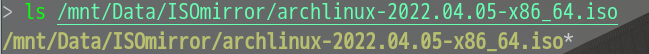
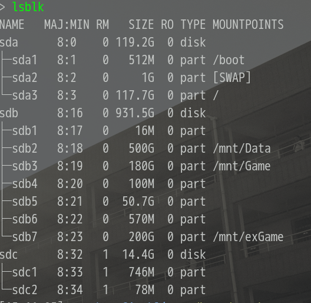
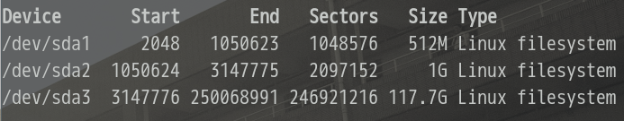

## Archlinux 安装指南

### 安装前准备

#### U 盘安装盘制作

制作安装盘会将 U 盘中的数据全都删除，请注意数据备份！(数据无价，谨慎操作）

将[archlinux ISO 文件](archlinux.org/download)下载到系统中，这里提供个国内网易镜像站的[下载地址](http://mirrors.163.com/archlinux/iso/latest/)



##### linux 用户

1. 将U盘插入电脑

2. 查看U盘所对应的设备号

```bash
lsblk
```


可以看到图中我的U盘为 `/dev/sdc` 记住自己的设备号

3. 使用 `dd` 命令将 ISO 文件写入到U盘中

```bash
dd if=/path/to/iso of=/path/to/dev bs=2M
```

其中 if= 后接 ISO 文件的路径，of= 后接设备的路径，bs= 接拷贝速率（默认为512k）。
以图中 ISO 文件路径和 U 盘路径为例，则 dd 命令为

```bash
dd if=/mnt/Data/ISOmirror/archlinux-2022.04.05-x86_64.iso of=/dev/sdc bs=2M
```
到此，U盘安装盘制作完成

##### Windows 用户

Windows 用户可以使用 rufus, 软碟通(ultraISO) 等来制作 U 盘安装盘

1. 将U盘插入电脑

2. 打开安装盘制作软件，选择 ISO 文件和 U 盘，然后开始安装

#### BIOS设置启动项

请搜索自己使用的电脑品牌进入 BIOS 的按键，然后在开机的使用间断按下按键，然后进入到 BIOS 界面

##### 必须设置项

- 对于 archlinux 来说，最好将引导设置为 UEFI 引导模式
- 在启动项顺序中将 U 盘启动项调到最前面

##### 建议设置项

- 可以将 F12(亦或是其他按键，看设置中的说明) 选择启动项打开，这样可以在开机的时候按下按键然后选择启动项

设置完启动项后 F10 保存并退出 BIOS 界面。

#### 进入 live 系统

进入到 U 盘启动项后，可以看到 archlinux live system 的启动选项，选择默认第一项启动进入到 live 系统

### 官方安装指南

[官方安装指南](wiki.archlinux.org/title/installation_guide)中指出了安装archlinux最简系统所需要的步骤，但其中缺少了一些步骤，使得在安装过程中或安装完成后的使用存在些问题。

### 我的安装流程

~~ 如果你使用网线连接电脑的话，则跳过第一步 ~~

1. 连接网络

```bash
iwctl

# 然后进入到 iwctl 命令中, 接下来的命令是在 iwctl 中使用的

# 查看可使用的设备
station list

# 扫描网络环境, 以下 wlan0 替换成 `station list` 列出的设备名称
station wlan0 scan

# 获得 WiFi 信息
station wlan0 get-network

#连接 WiFi
station wlan0 connect wifiname

#连接隐藏 WiFi
station wlan0 connect-hidden wifiname

#查看设备连接情况
station wlan0 status
```

测试网络是否连接, Ctrl+c 退出测试

```bash
ping bing.com
```

2. 设置网络时钟

```bash
timedatectl set-ntp true
```

3. 硬盘分区

```bash
# 查看硬盘信息
fdisk -l

# 硬盘分区, sda 替换成要分区的硬盘设备
# 如果只有一块硬盘则一般为sda，如果有两块硬盘，则看你是要使用哪块（两块一般分别为sda，sdb）
fdisk /dev/sda

# 接下来命令为在fdisk中使用
# 显示帮助信息
m

# 格式化为一块 gpt 类型的分区
g

# 新建分区
n
1. 输入设备号[可保持默认，直接回车]
2. 输入分区开始地址[可保持默认，直接回车]
3. 输入分区大小[例如 `+500M` , 默认为硬盘剩余大小]

# UEFI 引导模式下 archlinux 需要创建 3 块分区，去对应挂载点分别为 /boot, swap, /
# 3 块分区大小官方建议为
# /boot 分区至少300M
# swap 分区大于512M
# / 分区（即 根分区)可直接为剩余大小

# 写入分区设置信息并退出fdisk
w
```


可仿照我的分区情况进行分区，如果你的内存比较小的话可以把 swap 分区给大点

以为步骤按此图中的分区信息进行设置

4. 格式化分区文件系统

根据上图分区情况对分区进行文件系统更改

```bash
# /boot 分区
mkfs.fat -F 32 /dev/sda1

# swap 分区
mkswap /dev/sda2

# / 分区
mkfs.ext4 /dev/sda3
```

5. 挂载分区

```bsah
# 挂载 / 分区
mount /dev/sda3 /mnt

# 挂载 /boot 分区
mkdir /mnt/boot
mount /dev/sda1 /mnt/boot
# [注] 官方安装指南中此处为一条命令 `mount --mkdir /dev/sda1 /mnt/boot` ，但实际使用中好像 mount 命令已经不支持 --mkdir 选项了

# 开启 swap 分区
swapon /dev/sda2
```

6. 更改镜像源

```bash
reflector --country China --age 24 --protocol https --sort rate --save /etc/pacman.d/mirrorlist
```

7. 写入 archlinux 系统

```bash
pacstrap /mnt base base-devel linux linux-firmware dhcpcd neovim networkmanager

# base, linux, linux-firmware: 基础包
# base-devel: 使用 AUR 构建包时会使用到
# dhcpcd: 动态 ip 地址分配
# NetworkManager: 网络管理器，联网时使用
# neovim: 文本编辑器，亦可使用 vim，nano等
```

8. 生成系统挂载信息

```bash
genfstab -U /mnt >> /mnt/etc/fstab
```

到此，系统安装完成，接下来到新系统中完成初始配置

9. 新系统配置

```bash
# 切换到新系统中
arch-chroot /mnt

# 安装 fish, 有命令补全自动大小写，pacman补全包名等功能
pacman -S fish

# 设置默认 shell 为 fish，设置在下次登录时才起作用，
# 如果想现在就使用，亦可直接使用命令 fish 临时进入到 fish 中
chsh -s /bin/fish

# 设置 root 用户密码
passwd
# 然后分两次输入想设置的 root 密码

# 设置时区
ln -sf /usr/share/zoneinfo/Asia/Shanghai /etc/localtime
hwclock --systohc

# 设置系统支持语言
# 编辑 /etc/locale.gen 文件, 将 en_US.UTF-8 UTF-8, zh_CN.UTF-8 UTF-8, zh_CN.GBK GBK 前面的注释符`#`删掉
# 运行下面命令
locale-gen

# 设置系统语言
# 创建并编辑 /etc/locale.conf 文件，在文件中写入如下语句
LANG=en_US.UTF-8

# 设置电脑名
# 创建编辑 /etc/hostname 文件，写入想设置的电脑名
mycomputername

# 创建普通用户
useradd -m -g users -G wheel -s /bin/fish username
# 把 username 改成创建的用户名

# 给创建的普通用户设置密码
passwd username
# 同设置 root 用户密码一样需要输入两次

# dhcpcd，NetworkManager服务系统开机自启动
systemctl enable dhcpcd NetworkManager
```

grub 引导配置（还是在新系统中）

```bash
# 查看 cpu 架构
uname -a

# 安装 grub 等包以实现引导配置
pacman -S grub efibootmgr intel-ucode os-prober ntfs-3g
# [注]
# intel-ucode: intel cpu 安装此包，amd cpu 安装 amd-ucode 包
# os-prober: 多系统安装时使用此包，grub 会查找其他系统的引导并加入到 arch 启动项中
# ntfs-3g: 如果你有其他分区是 ntfs 或安装有 windows 的话安装这个包使linux系统能够读取其中的内容

# 安装引导
grub-install --target=x86_64-efi --efi-directory=/boot --bootloader-id=Archlinux

# 生成 grub 配置文件
grub-mkconfig -o /boot/grub/grub.cfg
```

### 图形界面

```bash
pacman -S xorg lightdm i3

# [注]
# xorg: 图形界面服务
# lightdm: 显示管理亦登录管理器
# i3: i3 窗口管理器，如果你喜欢集成桌面环境的话，不用安装 lightdm 和 i3
# 直接安装 kde, gnome, xfce等更主流桌面环境，包名分别为

# kde --> plasma
# gnome --> gnome
# xfce --> xfce4
# dde(deepin desktop environment) --> deepin

# 配置 lightdm, 找到 seat 下 user session 取消注释并设置为 i3
------ /etc/lightdm/lightdm.conf --------
[Seat:*]
user-session=i3

# 设置 lightdm 服务自启动
systemctl enable lightdm

# 终端以及字体
pacman -S alacritty wqy-mirohei-lite wqy-zenhei ttf-dejavu

# 英伟达驱动
pacman -S nvidia-prime nvidia-settings nvidia-utils
# 需用使用英伟达驱动的软件使用 prime-run 命令启动，如 steam 可使用如下命令启动
prime-run steam &>/dev/null & disown
```

### 退回到live 系统中并重启

一直运行 `exit` 到 live 环境中

```bash
# 取消挂载
unmount -R /mnt

# 重启
reboot
```
